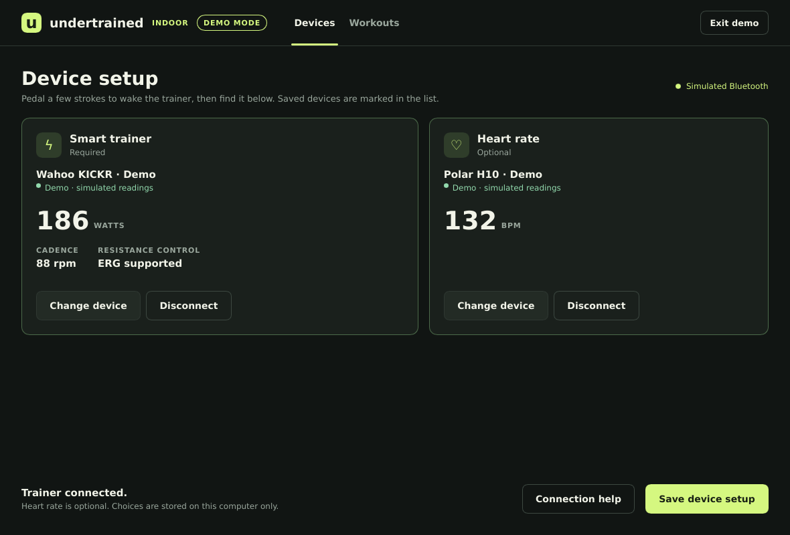
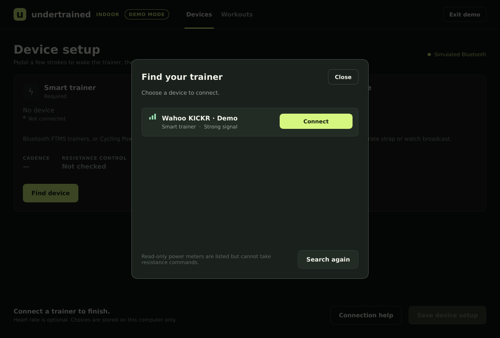
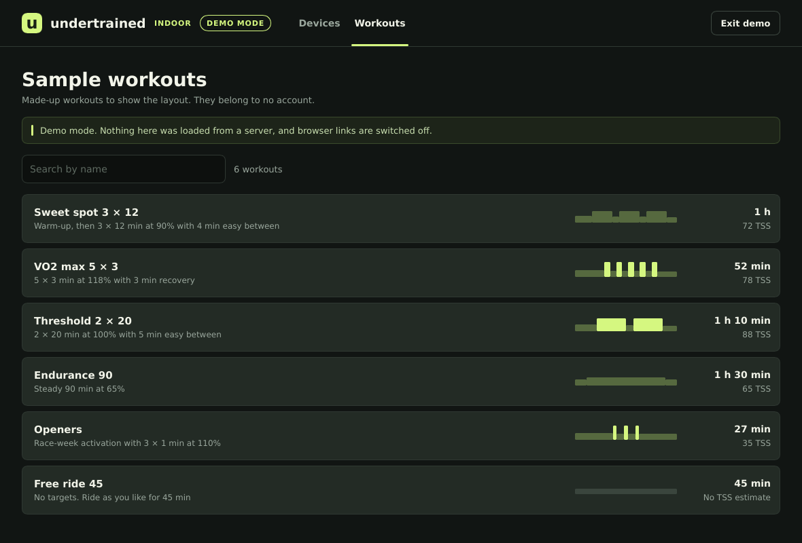

# Undertrained Indoor

A native desktop companion for home-trainer cycling, built with Rust and Slint. BLE only.






## This first version

- Sign in to your existing Undertrained account through your browser and Strava.
- Restore a verified desktop session from the operating system's credential store.
- Discover BLE smart trainers, power meters and heart-rate sensors.
- Connect and display FTMS power/cadence, Cycling Power power, and Heart Rate measurements.
- Read the FTMS feature flags to distinguish advertised ERG support from a read-only connection.
- Show connection failures, disconnected devices, weak signal and stale measurements.
- Save device choices locally and identify them in subsequent searches.
- List the account's cycling workouts, read-only, with duration, estimated TSS, summary and an intensity profile. Search by name, refresh on demand, and open a workout or the "new workout" page on the Undertrained website in the system browser.
- Explore the interface with clearly labeled demo devices and sample workouts, without signing in or saving simulated preferences.

This is the account, device-setup and workout-library milestone. It does **not** start workouts, send resistance commands, perform calibration, record rides, or create and edit workouts inside the desktop app. Separate cadence sensors, automatic reconnection, and automatic re-pairing of saved devices are not implemented yet. Devices that omit supported service UUIDs from advertisements may not appear. Hardware compatibility requires testing on actual trainers; the initial validation used software tests and simulated devices.

## Run

Install stable Rust with [rustup](https://rustup.rs/).

Linux build dependencies on Ubuntu/Debian:

```sh
sudo apt-get install build-essential pkg-config libfontconfig-dev libfreetype-dev libwayland-dev libxkbcommon-dev libxkbcommon-x11-0
cargo run --locked
```

Bluetooth uses the host's BlueZ service. Session persistence uses the desktop Secret Service keyring. If the keyring is unavailable, the current sign-in still works but cannot be remembered. D-Bus is compiled from the vendored dependency, so its development package is not required.

macOS requires Xcode Command Line Tools. Use `scripts/bundle-macos.sh` to create an app bundle with a Bluetooth usage description. Windows requires the MSVC Rust toolchain and Visual Studio C++ Build Tools. Cross-platform CI builds the application; hardware and OS permission behavior still need manual validation on each platform.

```sh
cargo run --locked -- --demo
cargo run --locked -- --demo-connected
cargo run --locked -- --demo-workouts
```

The normal launch opens the login screen. Enter your Undertrained server's origin, or set it before launch:

```sh
UNDERTRAINED_SERVER_URL=https://your-undertrained-server cargo run --locked
```

HTTP is accepted only for `localhost` and `127.0.0.1`. Tokens never go into the settings file. The settings file uses the OS application configuration directory returned by `directories`.

## Web-backend prerequisite

The companion change is [Undertrained PR #90](https://github.com/flaviendelangle/undertrained/pull/90), on `feat/desktop-auth`. It adds browser consent, PKCE code exchange, desktop session validation/revocation, and migration `0024_desktop_auth.sql`.

Deploy that change and apply its migration before using real sign-in. Existing browser login stays Strava-based. No Strava client secret is included in the desktop application. Demo mode works without the backend.

The workout list needs one more backend endpoint, `GET /api/desktop/workouts`, which returns the signed-in athlete's cycling workouts. That change is [Undertrained PR #91](https://github.com/flaviendelangle/undertrained/pull/91), a separate follow-up to the merged authentication PR. Until a server has it, the Workouts screen reports "This server has no workout API yet" and everything else keeps working. The desktop app never sends the session token to the browser: workout links open plain `/workouts/{id}` and `/workouts/new` pages, and the website handles its own login.

See [authentication](docs/authentication.md) for the contract and [design notes](docs/design.md) for the pairing-screen research.

## Development

```sh
cargo fmt --check
cargo clippy --locked --all-targets -- -D warnings
cargo test --locked
cargo run --locked -- --smoke-test
```

The smoke test exercises the actual Slint callbacks for demo login, role-filtered discovery, pairing, replacing a device, saving setup, switching to the workout list and searching it, returning to devices with pairings intact, disconnecting, and leaving the demo. On headless Linux, prefix it with `xvfb-run -a` and set `SLINT_BACKEND=winit-software`.

To capture the actual native window, without desktop decorations:

```sh
UNDERTRAINED_SCREENSHOT=login.png cargo run --locked
UNDERTRAINED_SCREENSHOT=devices.png cargo run --locked -- --demo-connected
UNDERTRAINED_SCREENSHOT=devices-empty.png cargo run --locked -- --demo
UNDERTRAINED_SCREENSHOT=device-picker.png cargo run --locked -- --demo-picker
UNDERTRAINED_SCREENSHOT=workouts.png cargo run --locked -- --demo-workouts
```

Capture mode skips restoring credentials, saves a PNG after rendering, and exits. Add `UNDERTRAINED_WINDOW_SIZE=880x620` to capture at the smallest supported window; it only applies in capture mode. No webview or web assets are used.

## Structure

- `ui/app.slint`: native interface and reusable controls.
- `src/main.rs`: application state, UI commands, demo mode and event delivery.
- `src/ble.rs`: Bluetooth ownership, discovery, connections and subscriptions.
- `src/model.rs`: protocol data decoding and malformed-packet tests.
- `src/auth.rs`: browser authorization, loopback callback, session exchange and keyring storage.
- `src/workouts.rs`: read-only workout fetch, request generations and name search, independent of the UI.
- `src/store.rs`: local device preferences.

This repository is private and does not grant a redistribution license. Slint and other dependencies have their own licensing terms; review those when preparing distribution.
