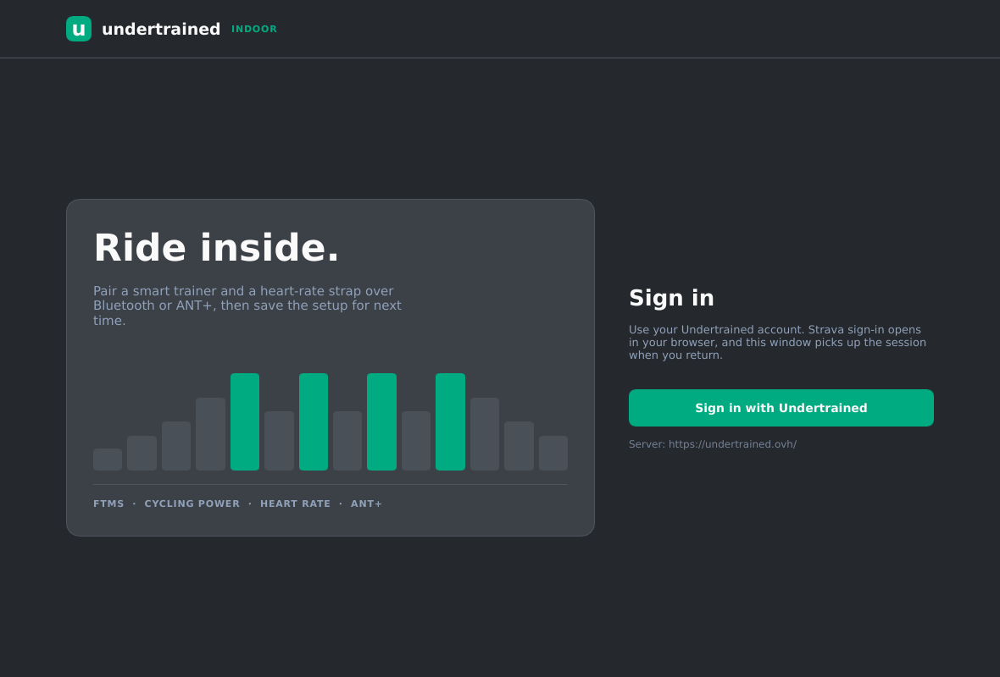
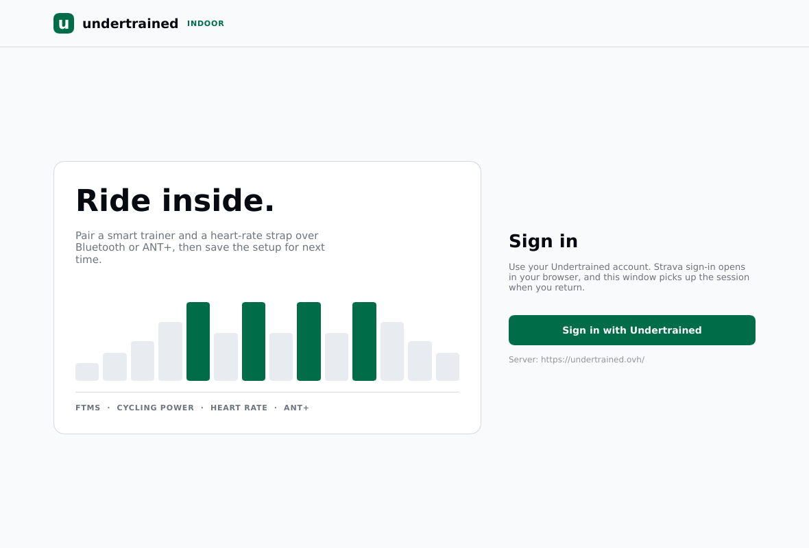

# Undertrained Indoor

A native desktop companion for home-trainer cycling, built with Rust and Slint, with Bluetooth LE and native USB ANT+ support.




The colors follow the Undertrained website and switch with the operating system's light or dark preference. Only the login screen is captured here: the other screens need a signed-in account and paired hardware, and the app has no simulation mode.

## This first version

- Sign in to your existing Undertrained account through your browser and Strava.
- Restore a verified desktop session from the operating system's credential store.
- Discover BLE smart trainers, power meters and heart-rate sensors.
- Connect and display FTMS power/cadence, Cycling Power power, and Heart Rate measurements.
- Read the FTMS feature flags to distinguish advertised ERG support from a read-only connection.
- Show connection failures, disconnected devices, weak signal and stale measurements.
- Save device choices locally and identify them in subsequent searches.
- Show the account's cycling workouts, read-only, as the website's card grid: a large profile chart per card drawn with native rectangles (accurate time widths, percent-of-FTP heights, seven-zone colors, grey free-ride blocks), with duration, estimated TSS and summary beneath. Search by name, refresh on demand, and open a workout or the "new workout" page on the Undertrained website in the system browser.
- Show the tests built into Undertrained (the server generates them for the athlete's current FTP, with localized names) alongside personal workouts, labeled "Built-in", with the server's duration wording and no invented TSS. Their browser link opens the website's built-in workouts section.
- Record a ride from a workout card or as a free ride from the device screen, with at least one connected sensor (a heart-rate strap alone is enough). The ride screen shows the elapsed clock, a large live power figure with heart rate and cadence, and a chart of the last ten minutes; pause freezes the clock, and a lost sensor leaves gaps rather than zeros. Finishing shows elapsed, average and maximum power and heart rate, and average cadence, and saves a journal plus a FIT file on this computer with a button to open the folder. The live chart colors power by zone only when the server reported the account's FTP with the built-in tests; otherwise the bars stay one neutral color. Speed and distance are not measured.
- Ride a workout step by step when the server sends its exact plan (see [workout playback](docs/workout-playback.md)). Beside the measured power, a target column shows the current target in watts (ramps interpolated, five-watt steps), how far off it you are with the website's tolerance, the step's duration and percent of FTP, its role, the time left with a bar that drains and lights up in the last five seconds, the next step, and the step's cadence cue and note. A plan bar with a playhead shows the whole workout, dims what is ridden and outlines the current step. Intensity moves in five-percent steps between 50 and 150 percent; Skip step advances the workout clock alone, never the recording's; a pause freezes both, and Resume picks the step up where it stopped. Reaching the end shows "Workout complete", releases the trainer and keeps recording as a free ride until Finish. The built-in tests play their timed steps with a notice that no FTP result is computed and that stopping is the rider's call; they offer no intensity change or skip. A workout from an older server, without step data, keeps its profile for reference only and says so.
- Control a Bluetooth FTMS trainer's resistance (ERG) during a guided ride, and only then: the switch is off on every ride until the rider enables it, and appears only for a connected Bluetooth trainer that advertised control (standard FTMS capability detection, no brand-specific handling) and is delivering power readings. Every command names the trainer it is for, so a target meant for a replaced trainer can never reach the next one. The status line tells apart a target being sent, a target the trainer confirmed, a release being sent, and control on with nothing in the trainer's hands (free step, pause, workout over); the figure shown is the figure sent, and nothing reads as released before the trainer answered. Free steps, pauses, the end of the workout, switching off and finishing ask for a release, queued before any journal or export write. A refused command, a lost control permission, a trainer that stops reporting power for five seconds or a disconnection switches control off, asks for one release, explains without claiming what the trainer's firmware did, and leaves the recording running; nothing is retried and nothing is re-enabled on reconnection. ANT+ trainers and read-only trainers get the same guidance to follow by hand, and a heart-rate-only ride is unaffected.
- Upload a saved ride to Strava through the Undertrained account, as the website does, and only when you press the button: name the activity (the recording on disk keeps its own name), then "Upload to Strava" sends the FIT file once and waits for Strava's answer. The screen tells apart done (with an "Open in Strava" link), still processing (check again), sent but unconfirmed (check Strava yourself before sending again; the app never resends on its own), and the reasons an upload could not start: expired session, a server without the upload API yet, Strava not connected on the website, network or server trouble. Every outcome leaves the files on this computer.
- Navigation stays open while recording (a header chip returns to the ride), while sign-out and closing the window ask first; a failed save keeps the samples in memory and offers a retry, and a running upload holds the screen until Strava answers.
- Discover sensors over Bluetooth and ANT+ (USB stick) at the same time, each radio reporting on its own, so a switched-off Bluetooth never hides an ANT+ strap. ANT+ trainers deliver readings only; ERG control over ANT+ is not implemented.
- Speak English and French, following the website's en-GB and fr-FR wording. The language follows the account when the server sends one, otherwise the operating system, otherwise English; it applies as soon as sign-in completes, and there is no switch in the app. Built-in workout names come from the server in that language; personal workout and device names are never translated.
- Follow the operating system's light or dark preference with the website's own colors, and show the Undertrained icon in the window and the desktop launcher.

This is the account, device-setup, workout-library, local-recording, upload and guided-workout milestone. It does **not** compute FTP-test results or detect when a rider gives up on a ramp, control ANT+ trainers, record targets or compliance in the FIT file, perform calibration, upload anything without a click, browse earlier recordings, or create and edit workouts inside the desktop app. BLE ERG control has not been validated against a physical trainer yet. Separate cadence sensors, automatic reconnection, and automatic re-pairing of saved devices are not implemented yet. Bluetooth devices that omit supported service UUIDs from advertisements may not appear. Heart-rate reception has been verified on this computer over BLE and ANT+, including ANT+ discovery with Bluetooth disabled. Trainer hardware and USB access on macOS/Windows still need testing. See [ANT+ implementation and hardware checks](docs/ant-bridge.md) for supported sticks, profiles and limitations.

## Run

The app lives in the `desktop/` directory of the Undertrained repository, next to the web app it signs in to. Run every command below from `desktop/`.

Install stable Rust with [rustup](https://rustup.rs/).

Linux build dependencies on Ubuntu/Debian:

```sh
sudo apt-get install build-essential pkg-config libfontconfig-dev libfreetype-dev libwayland-dev libxkbcommon-dev libxkbcommon-x11-0
cargo run --locked
```

Bluetooth uses the host's BlueZ service. Session persistence uses the desktop Secret Service keyring. If the keyring is unavailable, the current sign-in still works but cannot be remembered. D-Bus is compiled from the vendored dependency, so its development package is not required.

macOS requires Xcode Command Line Tools. Use `scripts/bundle-macos.sh` to create an app bundle with a Bluetooth usage description. Windows requires the MSVC Rust toolchain and Visual Studio C++ Build Tools. Cross-platform CI builds the application; hardware and OS permission behavior still need manual validation on each platform.

The app takes no launch options and refuses unknown ones. It opens on the login screen and requires an Undertrained sign-in; there is no demo or simulation mode. The Undertrained server is fixed when the binary is built and defaults to `https://undertrained.ovh/`. To build against another server, set the variable at compile time:

```sh
UNDERTRAINED_SERVER_URL=http://localhost:3000 cargo build --locked
```

The value is read with `option_env!`, so Cargo rebuilds when it changes and a running binary ignores the variable. The login screen shows which server the build uses. HTTP is accepted only for `localhost` and `127.0.0.1`; a build with an invalid address disables sign-in and explains why.

### Desktop icon and launcher on Linux

The window sets the app id `undertrained-indoor` and carries the Undertrained mark (`resources/icon.svg`, copied from the website's favicon, rasterized to `resources/icon.png` by `scripts/render-icon.py`). For the icon to appear in the application grid and the dock, install a launcher that points at the built binary:

```sh
cargo build --locked
scripts/install-linux-launcher.sh            # writes ~/.local/share/applications/undertrained-indoor.desktop
scripts/install-linux-launcher.sh --print    # show the entry instead
```

The entry uses absolute paths and `StartupWMClass=undertrained-indoor`, which is how GNOME and KDE pair the running window with the launcher. Re-run it after moving the repository or when switching to `--release`. On macOS, `scripts/bundle-macos.sh` builds `AppIcon.icns` from `resources/icon-1024.png` when Apple's `iconutil` is available. A session remembered in the keyring is restored only when it was created for the same server; otherwise it is left untouched. Tokens never go into the settings file. The settings file uses the OS application configuration directory returned by `directories`.

## Web-backend prerequisite

The companion change is [Undertrained PR #90](https://github.com/flaviendelangle/undertrained/pull/90), on `feat/desktop-auth`. It adds browser consent, PKCE code exchange, desktop session validation/revocation, and migration `0024_desktop_auth.sql`.

Deploy that change and apply its migration before using real sign-in. Existing browser login stays Strava-based. No Strava client secret is included in the desktop application.

The workout list needs one more backend endpoint, `GET /api/desktop/workouts`, which returns the signed-in athlete's cycling workouts. That change is [Undertrained PR #91](https://github.com/flaviendelangle/undertrained/pull/91), a separate follow-up to the merged authentication PR. Until a server has it, the Workouts screen reports "This server has no workout API yet" and everything else keeps working. The desktop app never sends the session token to the browser: workout links open plain `/workouts/{id}` and `/workouts/new` pages, and the website handles its own login.

[Undertrained PR #92](https://github.com/flaviendelangle/undertrained/pull/92) adds a `builtInWorkouts` field to the same response: the tests the website ships, generated server-side for the athlete's FTP, each with a slug id, a duration label and a reference FTP. The desktop app accepts responses with or without that field, validates slugs without hard-coding the catalogue, and links built-ins to `/workouts#built-in-workouts` rather than to a page per slug.

Uploads need [Undertrained PR #94](https://github.com/flaviendelangle/undertrained/pull/94), which adds `POST` and `GET /api/desktop/uploads`: the desktop app submits the FIT file with the activity name and gets a signed receipt, then polls that receipt until Strava reports the activity. Until that server change is deployed, the finished-ride screen says the server cannot receive rides yet and keeps the files local. The receipt, the upload intent and the confirmed activity are written next to the ride as separate small files (`upload.json`, `upload-ticket.json`, `upload-complete.json`), none of which holds the account token, so an interrupted upload is never submitted twice and a later click only checks its status.

See [authentication](docs/authentication.md) for the contract and [design notes](docs/design.md) for the pairing-screen research.

## Development

```sh
cargo fmt --check
cargo clippy --locked --all-targets -- -D warnings
cargo test --locked
cargo run --locked -- --smoke-test
```

The smoke test is the only launch flag. It drives the real Slint callbacks and presentation helpers with fixtures defined in `src/smoke.rs`: role-filtered discovery rows with a saved device, pairing and disconnect presentation, the workout list with search and no-match states, tab navigation that keeps pairings, refused browser links without a session, the ready-to-record screen fed by the sensor model (guided, reference-only and test workouts told apart by the plan alone), a real ride through the callbacks (start, samples, pause, resume, finish, idempotent finish, the guards on Back, sign-in, sign-out and other rides) recorded under a throwaway folder in the system temp directory that the test removes, the guided ride on a fixture plan (the target, delta and cues from the sensor model; a library refresh that never reaches the ride's copy; intensity steps; skip moving the workout clock without the recording's; ERG refused on a read-only trainer, commands addressed to the connected trainer's id, pending until the trainer answers, stale answers ignored, a refusal or a lost permission after a confirmed target switching it off with one captured release and no retry, pause queuing the release and freezing the step, resume sending the target again without skipping, five seconds without power switching it off and refusing to enable until a real reading (a measured zero counts) arrives, a disconnection switching it off with no reacquire on reconnection, completion releasing while the recording goes on, and finishing leaving control off), the upload refused without an account (nothing is sent), the sign-in offered from that expired state (a cancelled sign-in and the same account's return keep the ride and its title with the upload back; another account lets the saved ride go and is refused while one is at stake), the activity-name rules, and the signed-out reset. It touches no account, keyring, network or Bluetooth hardware, and nothing in it is reachable from a normal launch. On headless Linux, prefix it with `xvfb-run -a` and set `SLINT_BACKEND=winit-software`.

To capture the actual native window, without desktop decorations:

```sh
UNDERTRAINED_SCREENSHOT=login.png UNDERTRAINED_COLOR_SCHEME=dark cargo run --locked
UNDERTRAINED_SCREENSHOT=login-light.png UNDERTRAINED_COLOR_SCHEME=light cargo run --locked
```

Capture mode skips restoring credentials, saves a PNG after rendering, and exits. Three options apply only in capture mode: `UNDERTRAINED_WINDOW_SIZE=880x620` renders at the smallest supported window, `UNDERTRAINED_COLOR_SCHEME=light|dark` forces a palette instead of asking the operating system, and `UNDERTRAINED_LANGUAGE=en|fr` forces the interface language. No webview or web assets are used.

### Translations

[Undertrained PR #93](https://github.com/flaviendelangle/undertrained/pull/93) exposes the account language and lets the desktop request built-in workouts in its selected locale. Until that backend change is deployed, the interface still switches languages, but built-in names follow the server account preference.

Interface text is written in English inside `ui/app.slint` as `@tr("...")` and translated by gettext catalogs that Slint bundles into the binary at build time: `ui/lang/<lang>/LC_MESSAGES/undertrained-indoor.po`, keyed by the English string without a per-component context. To add or change a string, edit the Slint file, then add the `msgid` and its `msgstr` to the French catalog; plurals use `msgid_plural` with the catalog's `Plural-Forms`. Rust only formats language-dependent values (durations, meta lines, ANT+ device names) in `src/i18n.rs`, which also resolves which language applies. Raw transport and server diagnostics stay untranslated and appear as a detail line under the translated summary.

## Structure

- `ui/app.slint`: native interface and reusable controls.
- `src/main.rs`: application state, UI commands and event delivery.
- `src/i18n.rs`: language resolution and the few language-dependent strings Rust formats.
- `src/sensors.rs`, `src/ant.rs`: the merged Bluetooth and ANT+ discovery, and the ANT+ USB driver.
- `ui/lang/`: bundled translation catalogs.
- `src/smoke.rs`: developer smoke test with its own fixtures, behind `--smoke-test`.
- `src/ble.rs`: Bluetooth ownership, discovery, connections and subscriptions.
- `src/model.rs`: protocol data decoding and malformed-packet tests.
- `src/auth.rs`: browser authorization, loopback callback, session exchange and keyring storage.
- `src/workouts.rs`: read-only workout fetch for personal and built-in workouts, request generations and name search, independent of the UI.
- `src/recording.rs`, `src/fit.rs`: the sensor freshness model, the ride journal and the FIT export.
- `src/upload.rs`: the Strava upload through the desktop API, with its on-disk intent, receipt and completion files.
- `src/recording_view.rs`: clock and value formatting, chart binning, the target delta and cadence-cue rules, and the activity-name rule for the ride screen.
- `src/player.rs`, `src/ftms.rs`: exact step playback over a plan, and the serialized FTMS control-point exchange behind ERG.
- `src/store.rs`: local device preferences.
- `resources/`: icon sources and the macOS bundle manifest.
- `scripts/`: icon rendering, the Linux launcher installer and the macOS bundler.

The source is public but does not grant a redistribution license. Slint and other dependencies have their own licensing terms; review those when preparing distribution.
